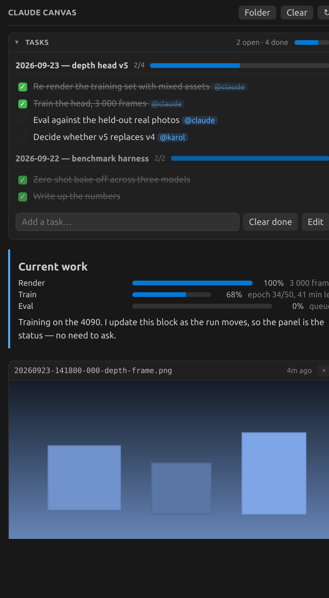

# Claude Canvas

Claude Code can see your images. You cannot see Claude's. A markdown image in its reply renders as
the literal text `[Image]`, so every "show me the plot" ends with a file path you have to open
yourself — and a long job runs with no visible progress at all.

Claude Canvas is a VS Code side panel that Claude writes to. Images show up as images, the current
state of the work stays pinned at the top, and a task list sits above both that you and Claude
edit at the same time.



There is no protocol and no server. The extension watches `.claude/canvas/` and re-renders.
Anything that can write a file can put something on the board.

## Install

Two halves: the **plugin** teaches Claude Code to use the board, the **extension** draws it.

**Plugin** (in Claude Code):

```
/plugin marketplace add Wojak27/claude-canvas
/plugin install claude-canvas@claude-canvas
```

**Extension** (in VS Code) — grab the `.vsix` from
[Releases](https://github.com/Wojak27/claude-canvas/releases), then:

```bash
code --install-extension claude-canvas-*.vsix
```

Reload the window. A new icon appears in the activity bar. Or build it yourself:

```bash
cd extension && ./build.sh && code --install-extension claude-canvas-*.vsix
```

## What the plugin does

- Puts `canvas` on Claude's PATH, so it can push to the board with one command.
- Ships a skill that tells Claude when to use it: "show me" requests, long-running jobs, and
  multi-step work worth tracking.
- **SessionStart** — creates `.claude/canvas/` and brings the panel up. `CLAUDE_CANVAS_AUTO_OPEN=0`
  to stop it opening.
- **PostToolUse on `Read`** — any image Claude reads lands on the board automatically, so you see
  what it just looked at. `CLAUDE_CANVAS_AUTO_SHOW=0` to turn that off.

## The board

| block | file | what it is |
|---|---|---|
| Tasks | `.claude/canvas/tasks.md` | Collapsible, at the top. One `##` section per session, newest first. |
| State | `.claude/canvas/state.md` | What is running right now. |
| Feed | `.claude/canvas/feed/` | Cards, newest first. Images inline, `.md` rendered. |

Tasks are plain markdown, so they diff and edit like anything else:

```markdown
# Tasks

## 2026-09-23 — depth head v5
- [x] Re-render the training set with mixed assets @claude
- [ ] Eval against the held-out real photos @claude
```

Clicking a row rewrites that line in place. There's an inline add box, `@mentions` and `#tags`
render as chips, older sections dim, and the activity-bar icon carries the open count.

## The `canvas` command

```bash
canvas show out/depth.png "Depth map, frame 412"   # symlinks; --copy to copy
canvas note "Epoch 34" <<'MD'                      # markdown card, body on stdin
canvas state < status.md                           # replace the pinned block
canvas open                                        # bring the panel up
canvas task session "2026-09-23 — depth head v5"
canvas task add "Re-render with mixed assets @claude"
canvas task list                                   # numbered
canvas task done 2 3
canvas clear
```

Without the plugin it lives at `plugin/bin/canvas` — copy it anywhere on your PATH.

## Markdown

Headings, paragraphs, lists, task lists, tables, quotes, rules, links, inline and fenced code,
images (relative paths resolve against the card's own folder), and a `progress` block:

```progress
Render: 100 | 3 000 frames
Train: 68 | epoch 34/50, 41 min left
```

Each line is `label: <percent> | optional note`. The renderer is ~150 lines with no dependencies.

## Settings

| Setting | Default | Meaning |
|---|---|---|
| `claudeCanvas.folder` | `.claude/canvas` | Canvas folder, relative to the workspace root |
| `claudeCanvas.newestFirst` | `true` | Newest card at the top |
| `claudeCanvas.maxCards` | `60` | Cards rendered |
| `claudeCanvas.autoReveal` | `always` | Reveal the board when a new card appears |

Commands, all under `Claude Canvas:` — Show Board, Open Board in Editor Tab, Open tasks.md,
Start Task Session, Clear Feed, Reveal Canvas Folder.

## Notes

The webview's `localResourceRoots` includes `/`, so a card can show an image from anywhere on the
machine rather than only from inside the workspace. That is deliberate — renders usually live
outside the repo — but it is broader than the usual webview sandbox, and worth knowing before you
install it somewhere shared.

Requires VS Code 1.85+, and `bash` + `python3` for the CLI. Works over Remote-SSH (the extension
runs on the remote, where the files are).

MIT. Built with [Claude Code](https://claude.com/claude-code).
