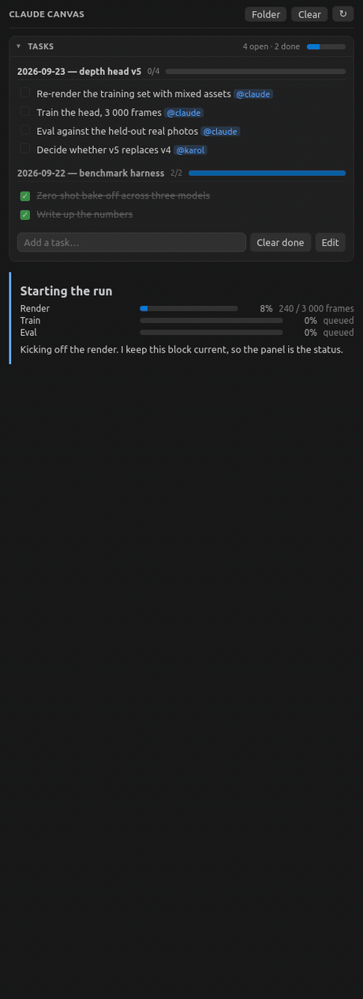
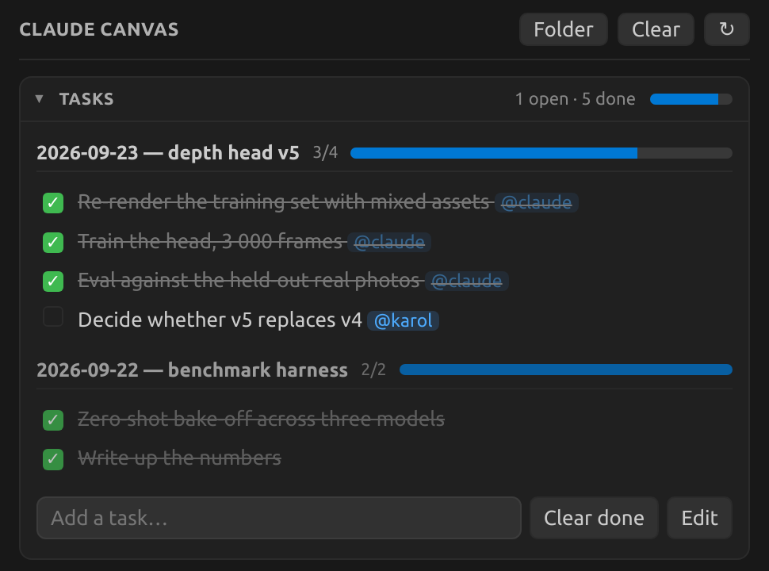
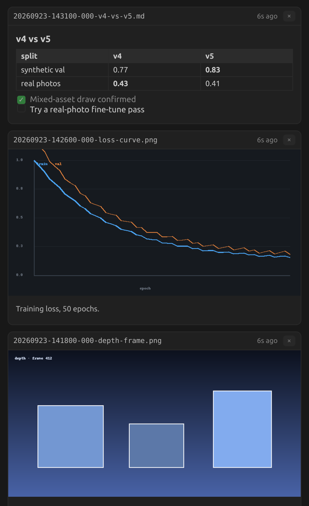
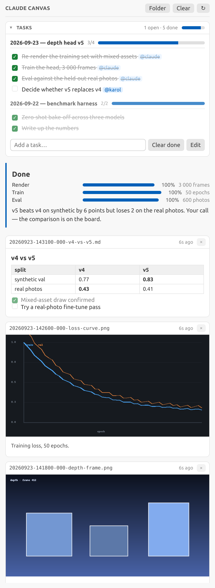
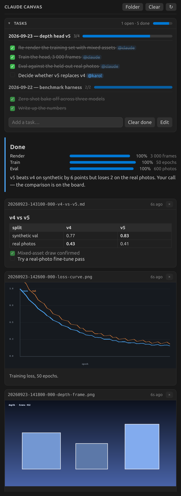

<div align="center">


# Claude Canvas

**Claude Code can see your images. You can't see its.**
A VS Code side panel that Claude writes to — images, live progress, and a task list you both edit.

[](https://github.com/Wojak27/claude-canvas/releases)
[](https://code.visualstudio.com/)
[](LICENSE)
[](extension/package.json)



</div>

---

## The problem

A markdown image in Claude's reply renders as the literal text `[Image]`. So every *"show me the
plot"* ends the same way — Claude saves a file and hands you a path, and you go open it yourself.
Meanwhile a job that runs for forty minutes runs with no visible progress at all, so you keep
asking *"where are we?"*.

Claude Canvas gives Claude somewhere to put things. No protocol, no server: the extension watches
`.claude/canvas/` and re-renders. Anything that can write a file can put something on the board.

## Quick start

**1. The plugin** — teaches Claude Code to use the board (run inside Claude Code):

```
/plugin marketplace add Wojak27/claude-canvas
/plugin install claude-canvas@claude-canvas
```

**2. The panel** — download the `.vsix` from [Releases](https://github.com/Wojak27/claude-canvas/releases):

```bash
code --install-extension claude-canvas-*.vsix
```

Reload the window. That's it — ask Claude to show you something.

<details>
<summary>Build it from source instead</summary>

```bash
git clone https://github.com/Wojak27/claude-canvas
cd claude-canvas/extension && ./build.sh
code --install-extension claude-canvas-*.vsix
```

No npm install, no bundler — the extension is plain JavaScript with zero dependencies, and
`build.sh` packs the `.vsix` by hand.
</details>

---

## What you get

### A task list you both edit



Backed by `tasks.md` — plain markdown, one `##` section per session, newest first. Claude opens a
session when you hand it a piece of work and ticks rows as they land. You click rows in the panel,
which rewrites that line in place. Same file, both directions, no sync layer.

```markdown
## 2026-09-23 — depth head v5
- [x] Re-render the training set with mixed assets @claude
- [ ] Decide whether v5 replaces v4 @karol
```

`@mentions` and `#tags` render as chips, finished sections dim, and the activity-bar icon carries
the open count.

### Images, as images



```bash
canvas show out/depth.png "Depth on a held-out frame"
```

The file is symlinked, so a 40 MB render costs nothing. Click a card to open the real file. With
the plugin installed, **any image Claude reads lands here automatically** — you see what it just
looked at, without asking.

### A status block that stays current

~~~bash
canvas state <<'MD'
# Training

```progress
Render: 100 | 3 000 frames
Train: 68 | epoch 34/50, 41 min left
```
MD
~~~

Pinned above the feed. Each `progress` line is `label: <percent> | optional note`. The point is
that you stop asking where things are.

### Status that refreshes itself

When the status comes from a command — a job queue, a log tail, GPU use — register the command
instead of pasting its output once:

```bash
canvas live add jobs --every 60s --title "Running jobs" <<'SH'
echo '| job | state | time |'; echo '|---|---|---|'
squeue -u "$USER" -h -o '| %j | %T | %M / %l |'
SH
```

That writes `.claude/canvas/live/jobs.sh`, runs it once, and prints what the board will show. From
then on the extension re-runs it every 60 s while the board is visible and swaps the output in
place, so a refresh never eats a half-typed task. Runs start in the workspace root, time out after
30 s, and never overlap. A failed run shows its exit code and stderr under the last good output
instead of replacing it. Edit the script and it re-runs at once; ↻ on the block re-runs it by hand.
`# every: 5m` and `# title: …` in a script's first lines configure it (at least 5 s).

### Charts you can poke at, not PNGs

For numbers, Claude writes a **widget**, a few lines of JSON, instead of rendering yet another
image. The board draws it interactive and in your theme:

```bash
canvas widget <<'JSON'
{"type": "line", "title": "Validation mAP", "src": "results/train_log.csv",
 "x": "epoch", "y": "val_mAP", "series": "arm", "yPercent": true}
JSON
```

- **Types:** `line`, `bar`, `scatter`, `heatmap`, `stat` (headline numbers with deltas and
  sparklines) and `table`.
- **Interaction:** hovering shows a crosshair readout of every series, clicking a legend entry
  hides a series, and a **Table** button shows the data as a sortable table.
- **Live data:** point `src` at the CSV your job appends to and the chart follows it, with no
  re-render step.
- **Anywhere markdown goes:** a widget also works as a fenced `widget` block in a note, the state
  block or a live block.
- **Colors:** from a palette validated for colorblind separation on both VS Code themes.
- **Format:** [WIDGETS.md](plugin/skills/claude-canvas/WIDGETS.md).

### One board per conversation

Two Claude Code sessions in one repo no longer write over each other. Each conversation gets its
own board: cards, state, tasks and live blocks. Each board is named after the first prompt of its
conversation, and `canvas title` renames it. A picker at the top of the panel either **follows
the latest activity** or pins one conversation. There is also a **Shared** board for anything
project-wide.

**⧉ opens the conversation in an editor tab**, and **⤢** on any card opens that card in a tab of
its own, which is handy for a chart. Tabs keep their own choice of conversation and come back
after a window reload.

### Light theme, obviously



Everything is drawn from VS Code's own theme tokens, so it matches whatever you're using.

<details>
<summary>The whole board in one shot</summary>


</details>

---

## How it works

```
.claude/canvas/
├── sessions/<id>/  one board per Claude Code conversation, same layout as below + meta.json
├── tasks.md        the Shared board: the collapsible block at the top
├── state.md        the pinned status
├── live/           blocks that re-run a command: jobs.sh, its output jobs.md, jobs.status.json
├── feed/           cards, newest first
│   ├── 20260923-141800-depth.png
│   ├── 20260923-141800-depth.caption.md
│   ├── 20260923-142500-val-map.widget.json
│   └── 20260923-143100-v4-vs-v5.md
├── .gitignore      `*`: board state is local, and cards symlink absolute paths
└── .open           a sentinel; writing a session id to it brings that board up
```

The extension watches that folder and re-renders. That's the whole design — which means it works
over Remote-SSH, from a script, from a cron job, or from a different machine writing over a share.

The plugin wires Claude into it:
- a **skill** describing when the board is the right answer
- `canvas` on Claude's **PATH**
- a **SessionStart** hook that creates the conversation's board, points `canvas` at it (through
  `CLAUDE_ENV_FILE`) and opens the panel
- a **UserPromptSubmit** hook that names the board after the first prompt
- a **PostToolUse** hook that pushes every image Claude reads

Turn the automatic parts off with `CLAUDE_CANVAS_AUTO_OPEN=0` and `CLAUDE_CANVAS_AUTO_SHOW=0`.

The plugin also ships an **MCP server** (`plugin/mcp/server.py`, standard-library Python) with
typed tools over the same board: `canvas_show`, `canvas_note`, `canvas_state`, `canvas_widget`,
`canvas_tasks`, `canvas_task`, `canvas_live_add`, `canvas_live_status`, `canvas_live_rm`,
`canvas_title` and `canvas_open`. Arguments are JSON, so there is no shell quoting, reads come
back structured (the task list, each live block's last exit code and stderr), and errors come back
as tool errors naming the problem. Every write goes through `bin/canvas`, so the tools and the CLI
cannot drift apart. The server finds its conversation through a small record the SessionStart
hook writes, `.claude/canvas/.pids/<claude pid>`, and it follows `/clear`.

Allow both once and they never prompt. A plugin can't grant itself permissions, so add these to
`permissions.allow` in `~/.claude/settings.json`:

```json
"Bash(canvas *)",
"mcp__plugin_claude-canvas_canvas__*"
```

## The `canvas` command

| Command | What it does |
|---|---|
| `canvas show  [caption]` | Image card. `--copy` to copy instead of symlink |
| `canvas note [title]` | Markdown card, body on stdin |
| `canvas state [file]` | Replace the pinned block (stdin or file) |
| `canvas task session <title>` | Start a session block |
| `canvas task add <text>` | Add to the newest session |
| `canvas task list` | Numbered list — read before editing |
| `canvas task done\|undo\|rm <n…>` | By those numbers |
| `canvas task cleardone` | Drop finished rows |
| `canvas live add <name> [--every 60s] [--title T]` | Live block from a script on stdin; runs it once and prints the output |
| `canvas live run\|rm <name>` · `canvas live ls` | Run once now · remove · list |
| `canvas widget [title]` | Interactive chart/table card from a JSON spec on stdin, validated first |
| `canvas title <text>` | Name this conversation's board |
| `canvas path` | Print this conversation's board folder |
| `canvas open` | Bring the panel up on this conversation |
| `canvas clear` | Remove every card |

`canvas` writes to the conversation in `CLAUDE_CANVAS_SESSION`, which the plugin sets. Scripts
and Slurm jobs started from a Claude session inherit it. `CLAUDE_CANVAS_SESSION=shared` writes
to the Shared board, and so does running `canvas` with no session at all.

Without the plugin it lives at `plugin/bin/canvas` — copy it onto your PATH.

## Markdown support

Headings, lists, task lists, tables, quotes, rules, links, inline and fenced code, images
(relative paths resolve against the card's own folder), `progress` blocks and `widget` blocks. The renderer is
~150 lines and has no dependencies, which is deliberate: a status panel should not ship a
megabyte of parser.

## Settings

| Setting | Default | Meaning |
|---|---|---|
| `claudeCanvas.folder` | `.claude/canvas` | Canvas folder, relative to the workspace root |
| `claudeCanvas.newestFirst` | `true` | Newest card at the top |
| `claudeCanvas.maxCards` | `60` | Cards rendered |
| `claudeCanvas.autoReveal` | `always` | Reveal the board when a new card appears |
| `claudeCanvas.liveBlocks` | `true` | Re-run the scripts in `live/` while the board is visible |
| `claudeCanvas.maxConversations` | `20` | Conversations listed in the picker, most recent first |

Commands, under `Claude Canvas:` — Show Board, Open Board in Editor Tab, Open tasks.md,
Start Task Session, Clear Feed, Reveal Canvas Folder.

## Worth knowing

- The webview's `localResourceRoots` includes `/`, so a card can show an image from anywhere on
  the machine — renders usually live outside the repo. It's broader than the usual webview
  sandbox; worth a look before installing somewhere shared.
- Live blocks mean the extension runs shell scripts it finds in `.claude/canvas/live/`. A repo could
  ship one, so they only run in a [trusted workspace](https://code.visualstudio.com/docs/editor/workspace-trust),
  and `claudeCanvas.liveBlocks: false` turns them off. The canvas folder writes its own
  `.gitignore` (`*`), so neither boards nor scripts end up in a commit by accident.
- A board's title is the first 60 characters of its conversation's first prompt, kept in
  `sessions/<id>/meta.json` on this machine. Rename it with `canvas title`.
- Requires VS Code 1.85+, plus `bash` and `python3` for the CLI.
- Works over Remote-SSH: the extension is `workspace`-kind, so it runs where your files are.

## Contributing

Issues and PRs welcome — it's a small codebase and an easy one to poke at.

```bash
extension/          the panel: extension.js, markdown.js, tasks.js, live.js, widgets.js,
                    media/widgets.js (the chart renderer), build.sh
tests/              ./tests/run.sh: hooks, CLI, MCP server, and the extension against a mocked
                    VS Code API; CI runs it on every push
plugin/             the Claude Code plugin: skill (+ WIDGETS.md), hooks, bin/canvas, mcp/server.py
scripts/            screenshot pipeline — ./scripts/screenshots.sh regenerates every image above
```

The screenshots in this README are rendered by the real extension code against demo folders in
`scripts/demo_scenes.py`, so they can't drift from what the panel actually draws.

## License

MIT. Built with [Claude Code](https://claude.com/claude-code).
